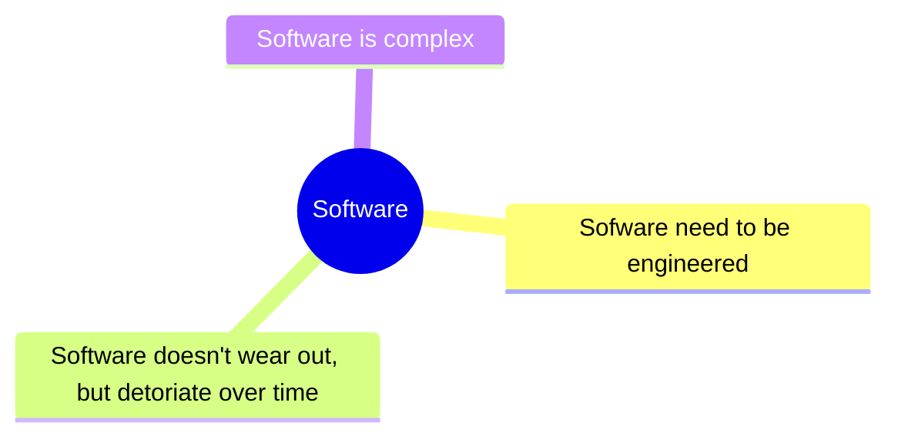
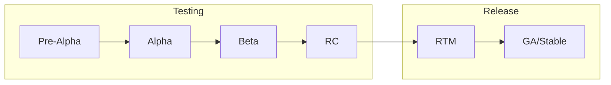
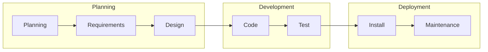
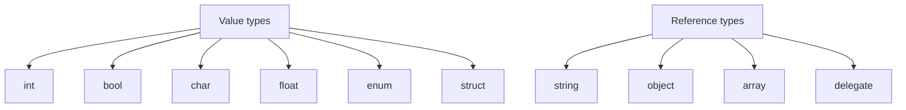
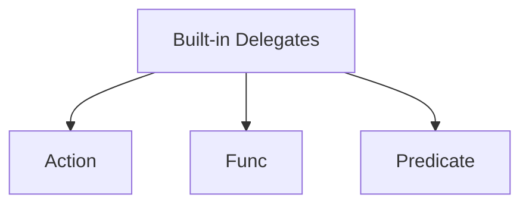

# `MCTE 4327` Software Engineering

## Table of Contents

- [Chapter 1 - Introduction](#chapter-1---introduction)
- [Chapter 2 - Software Engineering Principles](#chapter-2---software-engineering-principles)
- [Chapter 3 - Primitive Data Types](#chapter-3---primitive-data-types)
- [Chapter 4 - Object Oriented Programming](#chapter-4---object-oriented-programming)
- [Chapter 5 - Event Driven SE](#chapter-5---event-driven-se)
- [Chapter 7 - Graphical User Interface (GUI)](#chapter-7---graphical-user-interface-gui)

## Chapter 1 - Introduction


> Software is just a collection of instruction, to make a rock doing something useful.

In other words, **software** is **a collections of computer instruction that tell the hardware how to perform the task.**

Meanwhile, **hardware** is the physical matter that run the software.

### Programming languages

Modern programming languages, like C#, Python, Dart etc, are built on top of lower level programming languages.

#### Machine language

- Machine language is a low-level programming language that uses the binary numerals or hex to program computers.
- **Native language** of a particular processor architecture. Talks directly to the bare metal. Human barely can understand them.
- Processor dependent: a program written in one processor's machine language will not work on another processor without translation.
- Machine language is sometimes called **machine code** or **binary code**.

#### Assembly language

- Low-level programming language for a computer, or other programmable device.
- Each assembly language is specific to a particular computer architecture.
- Some syntax are understandable by human, but hardly to program it.
- It uses assembler to translate the assembly language into machine language.

#### C# language

- C# is a general-purpose, multi-paradigm programming language encompassing strong typing, imperative, declarative, functional, generic, object-oriented, and component-oriented programming disciplines.
- Developed by Microsoft within its [.NET](https://dotnet.microsoft.com/en-us/) initiative and later approved as a standard by Ecma ([ECMA-334](https://www.ecma-international.org/publications-and-standards/standards/ecma-334/)) and ISO ([ISO/IEC 23270:2018](https://www.iso.org/standard/75178.html)).

### Operating System


- An operating system (OS) is system software that manages computer hardware and software resources and provides common services for computer programs.
- Provide API for the application to interact with the hardware.

### Takeaways

- Modern programming languages built on multiple layers of abstraction.
- The lower the level of abstraction, the **easier to talk to the bare metal**.
- The higher the level of abstraction, the **easier to understand by human and job can be done faster.**

**[⬆ Back to top](#mcte-4327-software-engineering)**

## Chapter 2 - Software Engineering Principles


### Definition



### Sofware rot

~ is low detoriation of software performance over time or its deminishing responsiveness. Example of software rot is when a software is not maintained and updated, or change in environment _(eg: Windows XP to Windows 10, though, I've heard that Microsoft will keep as much backward compatibility as possible)_.

Some companies may have plan to deprecate the software after some times. For example, Microsoft have declared [End of Life (EOL) for Windows 7 and Windows 8.1](https://www.microsoft.com/en-us/windows/end-of-support) in favor of the newer versions of Windows. [Here](https://helpx.adobe.com/my_en/support/programs/eol-matrix.html) is another example of Adobe software that also have been declared end of support.

### Software release lifecycle



| Phase                               | Description                                                                                                                                   |
| ----------------------------------- | --------------------------------------------------------------------------------------------------------------------------------------------- |
| Pre-Alpha                           | The earliest stage of development where the software is not yet feature-complete and may be unstable or unusable. Tested internally           |
| Alpha                               | The software has basic functionality but may still have significant bugs or issues. Also tested internally                                    |
| Beta                                | The software is feature-complete and released to a limited audience for further testing and feedback. Start to test publicly                  |
| Release Candidate (RC)              | A version of the software that is intended to be very close to the final version, bug fixing may be needed before the official release.       |
| Release To Manufacturing (RTM)      | A term used primarily in software development for the commercial release of a product to the market. _(It's my first time knowing this term)_ |
| General Availability (GA) or Stable | The official release of the software that is considered stable and ready for general use.                                                     |

> **Info** The product MVP (Minimum Viable Product) is typically developed and released during the Alpha or Beta stages of the software release lifecycle.

You can see the example of the release process in many OSS, for example, in the [arduino-ide](https://github.com/arduino/arduino-ide/releases) development. Notice that, they started to release **beta** version publicly in the [`2.0.0-beta.1`](https://github.com/arduino/arduino-ide/releases/tag/2.0.0-beta.1) on 12 Feb 2021. After `beta.12`, they move to **RC** stages begin with [`2.0.0-rc1`](https://github.com/arduino/arduino-ide/releases/tag/2.0.0-rc1). Finally, the release the **stable** version [`2.0.0`](https://github.com/arduino/arduino-ide/releases/tag/2.0.0) on 14 September 2022. _Oh btw, software versioning is another interested topic to learn._

### Software Development Lifecycle (SDLC)

> aka Software Development Methodology

A process for planning, creating, testing, and deploying an application or system.

#### In general



#### Some examples of popular SDLC

| Methodology | Definition                                                                                                                                                                                                                                | Pros                                                                                                                                                                                    | Cons                                                                                                                                                              |
| ----------- | ----------------------------------------------------------------------------------------------------------------------------------------------------------------------------------------------------------------------------------------- | --------------------------------------------------------------------------------------------------------------------------------------------------------------------------------------- | ----------------------------------------------------------------------------------------------------------------------------------------------------------------- |
| Waterfall   | A linear, sequential approach to software development in which **each phase (requirements, design, implementation, testing, deployment, and maintenance) must be completed before moving on** to the next.                                | Easy to understand and manage, provides a clear path from start to finish, works well for projects with well-defined requirements.                                                      | Can be slow and inflexible, makes it difficult to respond to changing requirements or feedback, can result in a product that doesn't meet user needs.             |
| Incremental | A method of software development in which the **project is divided into smaller parts** or "increments," with each increment building on the previous one. Each increment includes the entire software development life cycle.            | Allows for early and frequent delivery of working software, makes it easier to respond to changes or feedback, reduces the risk of project failure by identifying problems early.       | Can be difficult to plan and manage, may require more resources and time than other methods, may result in a less cohesive product if not properly integrated.    |
| Prototype   | A method of software development in which a **preliminary version of the software is created** to test and evaluate ideas, concepts, and designs.                                                                                         | Allows for early and frequent feedback, enables rapid iteration and improvement, can help clarify and refine requirements.                                                              | Can be difficult to manage and control, may result in a product that doesn't meet user needs if not properly tested, can be costly and time-consuming.            |
| Spiral      | A method of software development in which the project is **divided into smaller parts, each of which goes through a series of iterative steps**, including planning, risk assessment, engineering, and evaluation.                        | Enables frequent and thorough risk assessment, allows for early and frequent feedback, enables continuous improvement and refinement.                                                   | Can be complex and difficult to manage, may require more resources and time than other methods, may result in a less cohesive product if not properly integrated. |
| Agile       | A method of software development that **emphasizes collaboration, flexibility, and rapid iteration**. Work is divided into small, self-contained units called "sprints," with each sprint delivering a working increment of the software. | Enables rapid response to changing requirements or feedback, encourages collaboration and communication among team members, allows for early and frequent delivery of working software. | Can be difficult to plan and manage, may require more resources and time than other methods, may result in a less cohesive product if not properly integrated.    |

### Requirement engineering

The process of **identifying, documenting, and managing requirements** for a product, system, or software to satisfy customer needs and business objectives.

#### Stages

1. Inception - Asks basic questions about the project, such as **what** the project is, **why** it is needed, and **who** will use it.
2. Elicitation - Address problems of scope/understanding/volatility.
3. Elaboration - Analysis model that identifies data, function, features, constraints and behavioral requirements.
4. Negotiation - Agree on a deliverable system
5. Specification

#### UML Diagrams

UML (Unified Modeling Language) diagrams that are commonly used in software engineering to help design and document software systems.

Some of the examples including:

##### Use case diagram


##### Class diagram


##### Sequence diagram


##### Activity diagram


**[⬆ Back to top](#mcte-4327-software-engineering)**

## Chapter 3 - Primitive Data Types


### Built in types

Below are some examples:

- `int` - 32-bit signed integer
- `double` - 64-bit floating point number
- `char` - 16-bit Unicode character
- `bool` - Boolean value

Read more on [docs](https://learn.microsoft.com/en-us/dotnet/csharp/language-reference/builtin-types/built-in-types)

### Reference VS Value Types

**Value types** are types that _hold their values_ directly and are stored on the stack. Usually **doesn't require** a `new` keyword to declare the value. [[Docs](https://learn.microsoft.com/en-us/dotnet/csharp/language-reference/builtin-types/value-types)]

**Reference types**, _hold a reference_ to a memory location where the actual data is stored on the heap. Usually **requires** a `new` keyword to create an instance of the type. [[Docs](https://learn.microsoft.com/en-us/dotnet/csharp/language-reference/keywords/reference-types)]


Example of value and reference types:



Example:

Assume `Coordinate` is a Class

```csharp
var pos1 = new Coordinate(101.2, 3.14);
var pos2 = pos1;

pos1.latitude = 300.2;

Console.WriteLine(pos1); // 300.2,3.14
Console.WriteLine(pos2); // 300.2,3.14
```

Since we have `pos2 = pos1`, `pos2` is a reference to `pos1`. So, when we change the value of `pos1`, `pos2` will also change.

Now, tet's change the `Coordinate` object from `Class` to a `struct`. Now, both value are independent. Changes with `pos1` will not affect `pos2`.

```csharp
...
Console.WriteLine(pos1); // 300.2,3.14
Console.WriteLine(pos2); // 101.2,3.14
```

There are some other examples, visit [here](https://github.com/iqfareez/MCTE-4327-Software-Engineering/blob/ea8efbdc837c1e31f103f54f5c15925cd7da2968/ConsoleApp1-2032023/ConsoleApp1-2032023/Program.cs#L90-L106) and [here](https://github.com/iqfareez/MCTE-4327-Software-Engineering/blob/ea8efbdc837c1e31f103f54f5c15925cd7da2968/ConsoleApp1-2232023/ConsoleApp1-2232023/Program.cs#L16-L32).

### `var` keyword

The `var` keyword is used to declare a variable of a type that is inferred from the value of the expression on the right side of the assignment operator. [[Docs](https://docs.microsoft.com/en-us/dotnet/csharp/language-reference/keywords/var)]

```csharp
var a = 10; // a is an int
var b = 10.5; // b is a double
var c = "Hello World UwU"; // c is a string
```

### Arrays

An array is a data structure that contains a group of elements of the same type. [[Docs](https://docs.microsoft.com/en-us/dotnet/csharp/programming-guide/arrays/)]

Example:

```csharp
int[] foo = new int[5]; // declare an array of 5 integers
foo[0] = 1;
foo[1] = 2;
foo[2] = 3;
foo[3] = 4;
foo[4] = 5;
```

or you can do it in one line:

```csharp
int[] foo = new int[5] {1, 2, 3, 4, 5};
```

### Iteration Statements

#### for-loop

The `for` loop is used to iterate a part of the program several times. [[Docs](https://learn.microsoft.com/en-us/dotnet/csharp/language-reference/statements/iteration-statements#the-for-statement)]

Take the array example above, we can use `for` loop to iterate through the array:

```csharp
for (int i = 0; i < foo.Length; i++)
{
    Console.WriteLine(foo[i]);
}
```

#### foreach-loop

The `foreach` loop is used to iterate through the elements of a collection. [[Docs](https://learn.microsoft.com/en-us/dotnet/csharp/language-reference/statements/iteration-statements#the-foreach-statement)]

```csharp
foreach (int i in foo)
{
    Console.WriteLine(i);
}
```

#### Takeways

`for` loop allows us to access the array element and modify it (if we wanted to). Meanwhile, `foreach` loop only allows us to read the array element but not modify it.

### Default value

The default value of a variable is the value that is assigned to it when it is declared. The default value of a variable depends on the type of the variable. [[Docs](https://docs.microsoft.com/en-us/dotnet/csharp/language-reference/keywords/default-values-table)]

```csharp
int a; // a is 0
double b; // b is 0
string c; // c is null
bool d; // d is false
```

> **Note** Any reference type will default to `null` if not initialized.

Note that the default value only be asssigned for **member variables** of a class/struct. Local variables must be initialized before use. See example code [here](https://github.com/iqfareez/MCTE-4327-Software-Engineering/blob/5d5a92e36ccd41a626d050fe8621395982756b2f/ConsoleApp1-2032023/ConsoleApp1-2032023/Program.cs#L112-L123).

For example, consider the code below:

```csharp
static void Main(string[] args)
{
    int a;
    Console.WriteLine(a);
}
```

The code above will yield an error: `Use of unassigned local variable 'a'`.

Let's consider another example:

```csharp
class Meow
{
    public int a;
}

class Program
{
    static void Main(string[] args)
    {
        var meow = new Meow();
        Console.WriteLine(meow.a); // 0
    }
}
```

This time, the uninitialized variable `a` will be assigned the default value of `0`. No error will be thrown.

### Anonymous Types

Anonymous types are used to create an object without having to explicitly define a type. [[Docs](https://docs.microsoft.com/en-us/dotnet/csharp/programming-guide/classes-and-structs/anonymous-types)]

```csharp
var kuceng = new { Name = "comot", Age = 4 };
Console.WriteLine(kuceng.toString()); // { Name = comot, Age = 4 }
```

However, anonymous types are **immutable**. You cannot change the value of the properties of an anonymous type.

```csharp
kuceng.Name = "mikail"; // error
```

### Methods

Methods? Oh, when a **function** is a part of a class, it's called a **method**.

> C# is an OOP language and doesn't have functions that are declared outside of classes, that's why all functions in C# are actually methods.
> Though, beside this formal difference, they are the same...

A method is a block of code that performs a specific task. [[Docs](https://docs.microsoft.com/en-us/dotnet/csharp/programming-guide/classes-and-structs/methods)]

#### Basic method

```csharp
private static void PrintHello()
{
    Console.WriteLine("Hello world");
}
```

#### Method with return value

```csharp
private static int AddNumber(int a, int b)
{
    return a + b;
}
```

#### Method with multiple return values (Tuple)

```csharp
static (string, int) LookupCat()
{
    return ("Cicik", 12);
}

// you can 'unpack' the tuple value:
(string catName, int catAge) = LookupCat();
Console.WriteLine(catName); // Cicik
Console.WriteLine(catAge); // 12
```

### String

A string is an object of type String whose value is text. [[Docs](https://learn.microsoft.com/en-us/dotnet/csharp/programming-guide/strings/)]

```csharp
var boo = "my message here";
Console.WriteLine(boo.Length); // 15

// substring
Console.WriteLine(boo.Substring(4, 8)); // essage h

// Splitting string. By default, the delimiter is " "
var s = boo.Split(); // ["my", "message", "here"]
```

#### `toString()` method

The `toString()` method is used to convert the value of a variable to a string. [[Docs](https://docs.microsoft.com/en-us/dotnet/api/system.object.tostring?view=net-5.0)]

```csharp
int z = 80;
DisplayMessage(z.ToString()); // 80
```

You can override the `toString()` method in your class.

Say you have the class below:

```csharp
 class City
{
    public string Name;
    public int Population;
}
```

Then,

```csharp
City petalingJaya = new City();
petalingJaya.Name = "Petaling Jaya";
petalingJaya.Population = 1000000;

Console.WriteLine(petalingJaya); // ConsoleApplication2.City

```

The output will be your namespace+class name. The output is perhaps not very useful. You can override the `toString()` method to make it more useful.

```csharp
public override string ToString()
{
    return $"{Name}: {Population}";
}
...
Console.WriteLine(petalingJaya); // Petaling Jaya: 1000000
```

### DateTime

Represents an instant in time, typically expressed as a date and time of day. [[Docs](https://learn.microsoft.com/en-us/dotnet/api/system.datetime?view=net-8.0)]

```csharp
// Get current date & time
DateTime now = DateTime.Now;
Console.WriteLine(now); // 2021-10-10 11:00:00

// format dateTime
Console.WriteLine(now.ToString("HH:mm, dddd")); // 11:00, Sunday
```

### Parsing

Usually from literal string to a specific type. Eg: string ➡️ int

```csharp
int.Parse("123"); // 123
int arg1 = int.Parse(args[0]);
```

### Exception Handling

An exception is an event, which occurs during the execution of a program, that disrupts the normal flow of the program's instructions. [[Docs](https://learn.microsoft.com/en-us/dotnet/csharp/fundamentals/exceptions/)]

By catching exceptions, you can handle errors in a controlled and graceful manner.

```csharp
try
{
    // code that might throw an exception
    int.Parse("abc");
}
catch (Exception ex)
{
    // code to handle the exception
    Console.WriteLine(ex.Message); // "Input string was "not in a correct format.
}
```

### Random Number

Represents a pseudo-random number generator, which is an algorithm that produces a sequence of numbers that meet certain statistical requirements for randomness. [[Docs](https://learn.microsoft.com/en-us/dotnet/api/system.random?view=net-8.0)]

```csharp
Random random = new Random();
int diceNumber = random.Next(1, 7);
Console.WriteLine(diceNumber); // 1-6
```

**[⬆ Back to top](#mcte-4327-software-engineering)**

## Chapter 4 - Object Oriented Programming


### 4 Pillars of OOP

Object Oriented Programming (OOP) is a popular programming paradigm that focuses on creating objects which contain both data and behavior. It is based on the concepts of encapsulation, inheritance, and polymorphism, and provides a way to organize and structure code in a more intuitive and efficient manner.


### Encapsulation

Encapsulation refers to the idea of bundling data and methods within a single unit, and restricting access to the data from outside that unit. In C#, encapsulation is achieved through the use of access modifiers such as `public` and `private`, and properties with getter and setter methods.

#### `public` and `private` access modifiers

To control wether members/methods can be accessed from outside the class.

- `public` - member/method can be accessed from anywhere.
- `private` - member/method can only be accessed from within the class.

```csharp
class BankAccount
{
    private double balance;

    public double GetBalance()
    {
        return balance;
    }

    public void Deposit(double amount)
    {
        balance += amount;
    }

    public void Withdraw(double amount)
    {
        balance -= amount;
    }
}
```

#### getter and setter methods

Getter and setter methods are used to access and modify the value of a private field. They are also known as accessor and mutator methods.

```csharp
class BankAccount
{
    private double balance;

    public double Balance
    {
        get { return balance; }
        private set { balance = value; }
    }

    public void Deposit(double amount)
    {
        Balance += amount;
    }

    public void Withdraw(double amount)
    {
        Balance -= amount;
    }
}
```

#### `static` keyword

A static member is associated with the type itself rather than with a specific object. You access static members without instantiating the class. [[Docs](https://docs.microsoft.com/en-us/dotnet/csharp/programming-guide/classes-and-structs/static-classes-and-static-class-members)]

```csharp
public static class TemperatureConverter
{
    public static double CelsiusToFahrenheit(string temperatureCelsius)
    {
        // Convert argument to double for calculations.
        double celsius = Double.Parse(temperatureCelsius);

        // Convert Celsius to Fahrenheit.
        double fahrenheit = (celsius * 9 / 5) + 32;

        return fahrenheit;
    }
}

class TestTemperatureConverter
{
    static void Main()
    {
        F = TemperatureConverter.CelsiusToFahrenheit(98.2);
    }
}

```

### Inheritance

Inheritance is a fundamental concept in OOP that allows you to create new classes based on existing ones. Inheritance enables you to reuse code from a parent class (also known as a superclass or base class) and extend or modify it in a child class (also known as a subclass or derived class). This makes your code more organized, easier to read, and less repetitive. [[Docs](https://learn.microsoft.com/en-us/dotnet/csharp/fundamentals/object-oriented/inheritance)]

```csharp
using System;

class Animal
{
    public string Name { get; set; }

    public Animal(string name)
    {
        Name = name;
    }

    public virtual void Speak()
    {
        Console.WriteLine($"{Name} makes a noise.");
    }
}

class Dog : Animal
{
    public Dog(string name) : base(name)
    {
    }

    public override void Speak()
    {
        Console.WriteLine($"{Name} barks.");
    }
}

class Program
{
    static void Main(string[] args)
    {
        Dog dog = new Dog("Rex");
        dog.Speak(); // Rex barks.
    }
}
```

#### `base` keyword

The `base` keyword is used to access members of the base class from within a derived class. [[Docs](https://docs.microsoft.com/en-us/dotnet/csharp/language-reference/keywords/base)]

```csharp
class Animal
{
    public string Name { get; set; }

    public Animal(string name)
    {
        Name = name;
    }

    public virtual void Speak()
    {
        Console.WriteLine($"{Name} makes a noise.");
    }
}

class Dog : Animal
{
    public Dog(string name) : base(name)
    {
    }

    public override void Speak()
    {
        base.Speak();
        Console.WriteLine($"{Name} barks.");
    }
}
```

#### Preventing inheritance

To prevent a class from being inherited, use the `sealed` keyword. [[Docs](https://docs.microsoft.com/en-us/dotnet/csharp/language-reference/keywords/sealed)]

```csharp
sealed class Animal
{
    // implementation
}
```

### Polymorphism

Polymorphism is the ability of an object to take on many forms. The most common use of polymorphism in OOP occurs when a parent class reference is used to refer to a child class object. [[Docs](https://learn.microsoft.com/en-us/dotnet/csharp/fundamentals/object-oriented/polymorphism)]

#### Upcasting & Downcasting

Upcasting is the process of converting a reference of a derived class to a base class. This is done automatically when you assign a derived class object to a base class reference. [[Docs](https://docs.microsoft.com/en-us/dotnet/csharp/programming-guide/types/casting-and-type-conversions#upcasting-and-downcasting)]

```csharp
// Assume Car class is inherited from Vehicle class
Car A = new Car();
A.brand = "Myvi";
A.type = "Compact";

// Upcasting (from Car to Vehicle)
Vehicle B = A;

Console.WriteLine(B.type); // Compact

// Downcasting (from Vehicle to Car)
Car C = (Car)B;
Console.WriteLine(C.brand); // Myvi
Console.WriteLine(C.type); // Compact
```

## Chapter 5 - Event Driven SE

### Delegate

A pointer to a function. [[Docs](https://docs.microsoft.com/en-us/dotnet/csharp/programming-guide/delegates/)]

```csharp
public delegate int Transformer(int x);

Transformer square = x => x * x;
var ans = square(3); // or square.Invoke(3)
Console.WriteLine(ans); // 9
```

> **Note** - The `=>` operator is called the **lambda operator**. It is used to define an anonymous method. [[Docs](https://docs.microsoft.com/en-us/dotnet/csharp/language-reference/operators/lambda-operator)]

### Built-in delegates

A built-in delegate is a pre-defined delegate type that is provided by the .NET Framework.



> **Note** - The built-in delegate can have up to 16 input parameters.

#### Action

Represents a method that has a `void` **return type** and takes zero or more input parameters.. [[Docs](https://docs.microsoft.com/en-us/dotnet/api/system.action?view=net-5.0)]

```csharp
Action<string> print = Console.WriteLine;
print("Hello World"); // Hello World
```

#### Func

Represents a method that has a **return type** and takes zero or more input parameters. [[Docs](https://docs.microsoft.com/en-us/dotnet/api/system.func-1?view=net-5.0)]

```csharp
Func<int, int, int> add = (x, y) => x + y;
var ans = add(3, 4); // or add.Invoke(3, 4)
Console.WriteLine(ans); // 7
```

> **Note** - The last parameter of the `Func` delegate is always the return type.

**[⬆ Back to top](#mcte-4327-software-engineering)**

## Chapter 7 - Graphical User Interface (GUI)

~ is a type of interface that allows users to interact with digital devices using **visual elements** such as icons, menus, and buttons, rather than text-based commands.

### Windows Forms

Windows Forms is a graphical user interface (GUI) subsystem provided by the .NET Framework. It is a managed code framework that provides a set of classes and other resources that you can use to create Windows-based applications. [[Docs](https://docs.microsoft.com/en-us/dotnet/desktop/winforms/?view=netdesktop-5.0)]

Example: [Label](https://learn.microsoft.com/en-us/dotnet/api/system.windows.forms.label?view=windowsdesktop-7.0), [Button](https://learn.microsoft.com/en-us/dotnet/api/system.windows.forms.button?view=windowsdesktop-7.0) and [MessageBox](https://learn.microsoft.com/en-us/dotnet/api/system.windows.forms.messagebox?view=windowsdesktop-8.0) elements.

```csharp
static void Main()
{
    Application.EnableVisualStyles();
    Application.SetCompatibleTextRenderingDefault(false);

    var form1 = new Form();
    form1.Text = "Form 1";
    form1.Width = 400;
    form1.Height = 300;

    Label label1 = new Label();
    label1.Text = "Welcome to this application";
    label1.Font = new System.Drawing.Font("Arial", 15);
    label1.Width = 300;
    label1.Height = 70;
    label1.Left = 40;
    label1.Top = 20;

    Button button1 = new Button();
    button1.Text = "Click me!";
    button1.Width = 100;
    button1.Height = 50;
    button1.Left = 150;
    button1.Top = 100;
    button1.Click += (a ,e) => MessageBox.Show("I've been clicked!", "My Dialog");

    form1.Controls.Add(label1);
    form1.Controls.Add(button1);

    Application.Run(form1);
}
```


### Timer

A timer is a control that raises an event at specified intervals. [[Docs](https://docs.microsoft.com/en-us/dotnet/api/system.windows.forms.timer?view=net-5.0)]

```csharp
// Tick event handler
private void timer1_Tick(object sender, EventArgs e)
{
    // The interval is set to 20 (ms) in the form designer.
    timerLabel.Text = DateTime.Now.ToString("HH:mm:ss, dddd");
}
```


When you set the `Interval` property to a positive integer value, the `Timer` starts counting down from that value in milliseconds. When the count reaches zero, the `Timer` raises the `Tick` event and resets the count to the `Interval` value, starting the countdown again.

To learn more on date & time formatting, visit [here](https://learn.microsoft.com/en-us/dotnet/standard/base-types/custom-date-and-time-format-strings).

**[⬆ Back to top](#mcte-4327-software-engineering)**

<!-- ## Chapter 12 - Software Security

 -->
