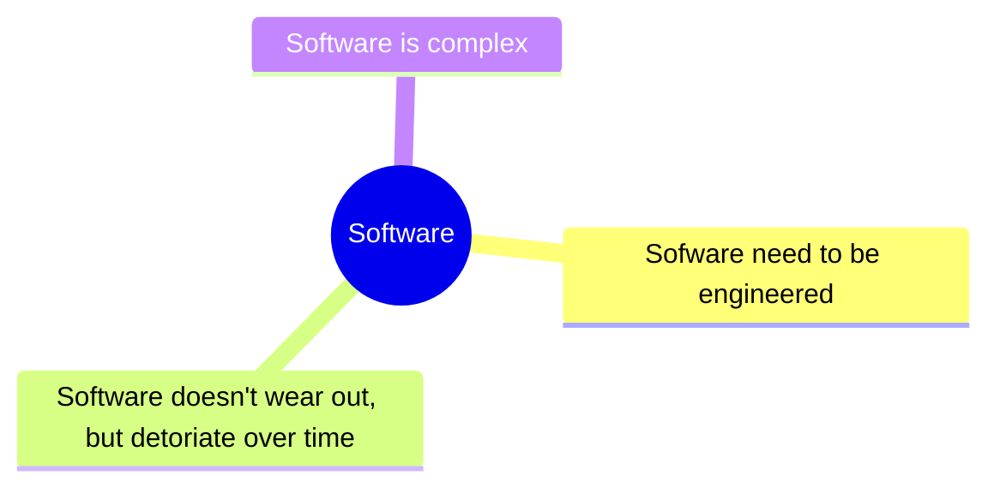
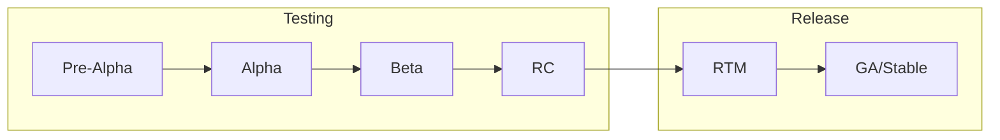
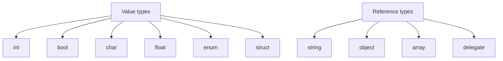

# `MCTE 4327` Software Engineering

## Table of Contents

- [Chapter 1 - Introduction](#chapter-1---introduction)
- [Chapter 2 - Software Engineering Principles](#chapter-2---software-engineering-principles)
- [Chapter 3 - Primitive Data Types](#chapter-3---primitive-data-types)

## Chapter 1 - Introduction

> Software is just a collection of instruction, to make a rock doing something useful.

In other words, **software** is **a collections of computer instruction that tell the hardware how to perform the task.**

Meanwhile, **hardware** is the physical matter that run the software.

### Programming languages

Modern programming languages, like C#, Python, Dart etc, are built on top of lower level programming languages.

#### Machine language

- Machine language is a low-level programming language that uses the binary numerals or hex to program computers.
- **Native language** of a particular processor architecture. Talks directly to the bare metal. Human barely can understand them.
- Processor dependent: a program written in one processor's machine language will not work on another processor without translation.
- Machine language is sometimes called **machine code** or **binary code**.

#### Assembly language

- Low-level programming language for a computer, or other programmable device.
- Each assembly language is specific to a particular computer architecture.
- Some syntax are understandable by human, but hardly to program it.
- It uses assembler to translate the assembly language into machine language.

#### C# language

- C# is a general-purpose, multi-paradigm programming language encompassing strong typing, imperative, declarative, functional, generic, object-oriented, and component-oriented programming disciplines.
- Developed by Microsoft within its [.NET](https://dotnet.microsoft.com/en-us/) initiative and later approved as a standard by Ecma ([ECMA-334](https://www.ecma-international.org/publications-and-standards/standards/ecma-334/)) and ISO ([ISO/IEC 23270:2018](https://www.iso.org/standard/75178.html)).

### Operating System

- An operating system (OS) is system software that manages computer hardware and software resources and provides common services for computer programs.
- Provide API for the application to interact with the hardware.

### Takeaways

- Modern programming languages built on multiple layers of abstraction.
- The lower the level of abstraction, the **easier to talk to the bare metal**.
- The higher the level of abstraction, the **easier to understand by human and job can be done faster.**

## Chapter 2 - Software Engineering Principles

### Definition

### Sofware rot

~ is low detoriation of software performance over time or its deminishing responsiveness. Example of software rot is when a software is not maintained and updated, or change in environment _(eg: Windows XP to Windows 10, though, I've heard that Microsoft will keep as much backward compatibility as possible)_.

Some companies may have plan to deprecate the software after some times. For example, Microsoft have declared [End of Life (EOL) for Windows 7 and Windows 8.1](https://www.microsoft.com/en-us/windows/end-of-support) in favor of the newer versions of Windows. [Here](https://helpx.adobe.com/my_en/support/programs/eol-matrix.html) is another example of Adobe software that also have been declared end of support.

### Software release lifecycle

| Phase                               | Description                                                                                                                                   |
| ----------------------------------- | --------------------------------------------------------------------------------------------------------------------------------------------- |
| Pre-Alpha                           | The earliest stage of development where the software is not yet feature-complete and may be unstable or unusable. Tested internally           |
| Alpha                               | The software has basic functionality but may still have significant bugs or issues. Also tested internally                                    |
| Beta                                | The software is feature-complete and released to a limited audience for further testing and feedback. Start to test publicly                  |
| Release Candidate (RC)              | A version of the software that is intended to be very close to the final version, bug fixing may be needed before the official release.       |
| Release To Manufacturing (RTM)      | A term used primarily in software development for the commercial release of a product to the market. _(It's my first time knowing this term)_ |
| General Availability (GA) or Stable | The official release of the software that is considered stable and ready for general use.                                                     |

> **Info** The product MVP (Minimum Viable Product) is typically developed and released during the Alpha or Beta stages of the software release lifecycle.

You can see the example of the release process in many OSS, for example, in the [arduino-ide](https://github.com/arduino/arduino-ide/releases) development. Notice that, they started to release **beta** version publicly in the [`2.0.0-beta.1`](https://github.com/arduino/arduino-ide/releases/tag/2.0.0-beta.1) on 12 Feb 2021. After `beta.12`, they move to **RC** stages begin with [`2.0.0-rc1`](https://github.com/arduino/arduino-ide/releases/tag/2.0.0-rc1). Finally, the release the **stable** version [`2.0.0`](https://github.com/arduino/arduino-ide/releases/tag/2.0.0) on 14 September 2022. _Oh btw, software versioning is another interested topic to learn._

## Chapter 3 - Primitive Data Types

### Built in types

Below are some examples:

- `int` - 32-bit signed integer
- `double` - 64-bit floating point number
- `char` - 16-bit Unicode character
- `bool` - Boolean value

Read more on [docs](https://learn.microsoft.com/en-us/dotnet/csharp/language-reference/builtin-types/built-in-types)

### Reference VS Value Types

**Value types** are types that _hold their values_ directly and are stored on the stack. Usually **doesn't require** a `new` keyword to declare the value. [[Docs](https://learn.microsoft.com/en-us/dotnet/csharp/language-reference/builtin-types/value-types)]

**Reference types**, _hold a reference_ to a memory location where the actual data is stored on the heap. Usually **requires** a `new` keyword to create an instance of the type. [[Docs](https://learn.microsoft.com/en-us/dotnet/csharp/language-reference/keywords/reference-types)]

Example of value and reference types:

<!-- ## Chapter 4 - Object Oriented Programming -->

<!-- ## Chapter 12 - Software Security

 -->
