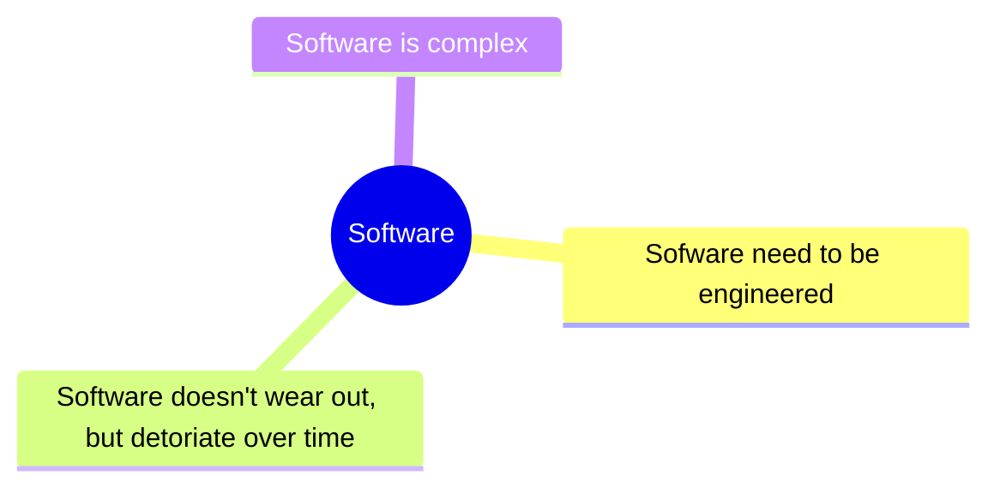
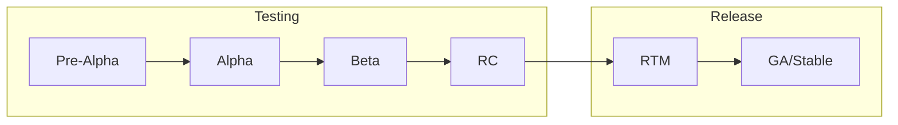
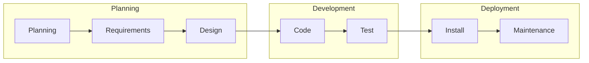
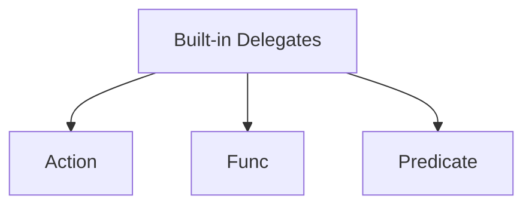

# `MCTE 4327` Software Engineering

## Table of Contents

- [Chapter 1 - Introduction](#chapter-1---introduction)
- [Chapter 2 - Software Engineering Principles](#chapter-2---software-engineering-principles)
- [Chapter 3 - Primitive Data Types](#chapter-3---primitive-data-types)
- [Chapter 4 - Object Oriented Programming](#chapter-4---object-oriented-programming)
- [Chapter 5 - Event Driven SE](#chapter-5---event-driven-se)
- [Chapter 6 - Data Structures](#chapter-6---data-structures)
- [Chapter 7 - Graphical User Interface (GUI)](#chapter-7---graphical-user-interface-gui)
- [Chapter 8 - Asynchronous Software Engineering](#chapter-8---asynchronous-se)
- [Chapter 9 - Parallel Computing](#chapter-9---parallel-computing)
- [Chapter 10 - Networking & Communication](#chapter-10---networking--communication)
- [Chapter 11 - Serilization](#)

## Chapter 1 - Introduction


> Software is just a collection of instruction, to make a rock doing something useful.

In other words, **software** is **a collections of computer instruction that tell the hardware how to perform the task.**

Meanwhile, **hardware** is the physical matter that run the software.

### Programming languages

Modern programming languages, like C#, Python, Dart etc, are built on top of lower level programming languages.

#### Machine language

- Machine language is a low-level programming language that uses the binary numerals or hex to program computers.
- **Native language** of a particular processor architecture. Talks directly to the bare metal. Human barely can understand them.
- Processor dependent: a program written in one processor's machine language will not work on another processor without translation.
- Machine language is sometimes called **machine code** or **binary code**.

#### Assembly language

- Low-level programming language for a computer, or other programmable device.
- Each assembly language is specific to a particular computer architecture.
- Some syntax are understandable by human, but hardly to program it.
- It uses assembler to translate the assembly language into machine language.

#### C# language

- C# is a general-purpose, multi-paradigm programming language encompassing strong typing, imperative, declarative, functional, generic, object-oriented, and component-oriented programming disciplines.
- Developed by Microsoft within its [.NET](https://dotnet.microsoft.com/en-us/) initiative and later approved as a standard by Ecma ([ECMA-334](https://www.ecma-international.org/publications-and-standards/standards/ecma-334/)) and ISO ([ISO/IEC 23270:2018](https://www.iso.org/standard/75178.html)).

### Operating System


- An operating system (OS) is system software that manages computer hardware and software resources and provides common services for computer programs.
- Provide API for the application to interact with the hardware.

### Takeaways

- Modern programming languages built on multiple layers of abstraction.
- The lower the level of abstraction, the **easier to talk to the bare metal**.
- The higher the level of abstraction, the **easier to understand by human and job can be done faster.**

**[⬆ Back to top](#mcte-4327-software-engineering)**

## Chapter 2 - Software Engineering Principles


### Definition



### Sofware rot

~ is low detoriation of software performance over time or its deminishing responsiveness. Example of software rot is when a software is not maintained and updated, or change in environment _(eg: Windows XP to Windows 10, though, I've heard that Microsoft will keep as much backward compatibility as possible)_.

Some companies may have plan to deprecate the software after some times. For example, Microsoft have declared [End of Life (EOL) for Windows 7 and Windows 8.1](https://www.microsoft.com/en-us/windows/end-of-support) in favor of the newer versions of Windows. [Here](https://helpx.adobe.com/my_en/support/programs/eol-matrix.html) is another example of Adobe software that also have been declared end of support.

### Software release lifecycle



| Phase                               | Description                                                                                                                                   |
| ----------------------------------- | --------------------------------------------------------------------------------------------------------------------------------------------- |
| Pre-Alpha                           | The earliest stage of development where the software is not yet feature-complete and may be unstable or unusable. Tested internally           |
| Alpha                               | The software has basic functionality but may still have significant bugs or issues. Also tested internally                                    |
| Beta                                | The software is feature-complete and released to a limited audience for further testing and feedback. Start to test publicly                  |
| Release Candidate (RC)              | A version of the software that is intended to be very close to the final version, bug fixing may be needed before the official release.       |
| Release To Manufacturing (RTM)      | A term used primarily in software development for the commercial release of a product to the market. _(It's my first time knowing this term)_ |
| General Availability (GA) or Stable | The official release of the software that is considered stable and ready for general use.                                                     |

> **Info** The product MVP (Minimum Viable Product) is typically developed and released during the Alpha or Beta stages of the software release lifecycle.

You can see the example of the release process in many OSS, for example, in the [arduino-ide](https://github.com/arduino/arduino-ide/releases) development. Notice that, they started to release **beta** version publicly in the [`2.0.0-beta.1`](https://github.com/arduino/arduino-ide/releases/tag/2.0.0-beta.1) on 12 Feb 2021. After `beta.12`, they move to **RC** stages begin with [`2.0.0-rc1`](https://github.com/arduino/arduino-ide/releases/tag/2.0.0-rc1). Finally, the release the **stable** version [`2.0.0`](https://github.com/arduino/arduino-ide/releases/tag/2.0.0) on 14 September 2022. _Oh btw, software versioning is another interested topic to learn._

### Software Development Lifecycle (SDLC)

> aka Software Development Methodology

A process for planning, creating, testing, and deploying an application or system.

#### In general



#### Some examples of popular SDLC

| Methodology | Definition                                                                                                                                                                                                                                | Pros                                                                                                                                                                                    | Cons                                                                                                                                                              |
| ----------- | ----------------------------------------------------------------------------------------------------------------------------------------------------------------------------------------------------------------------------------------- | --------------------------------------------------------------------------------------------------------------------------------------------------------------------------------------- | ----------------------------------------------------------------------------------------------------------------------------------------------------------------- |
| Waterfall   | A linear, sequential approach to software development in which **each phase (requirements, design, implementation, testing, deployment, and maintenance) must be completed before moving on** to the next.                                | Easy to understand and manage, provides a clear path from start to finish, works well for projects with well-defined requirements.                                                      | Can be slow and inflexible, makes it difficult to respond to changing requirements or feedback, can result in a product that doesn't meet user needs.             |
| Incremental | A method of software development in which the **project is divided into smaller parts** or "increments," with each increment building on the previous one. Each increment includes the entire software development life cycle.            | Allows for early and frequent delivery of working software, makes it easier to respond to changes or feedback, reduces the risk of project failure by identifying problems early.       | Can be difficult to plan and manage, may require more resources and time than other methods, may result in a less cohesive product if not properly integrated.    |
| Prototype   | A method of software development in which a **preliminary version of the software is created** to test and evaluate ideas, concepts, and designs.                                                                                         | Allows for early and frequent feedback, enables rapid iteration and improvement, can help clarify and refine requirements.                                                              | Can be difficult to manage and control, may result in a product that doesn't meet user needs if not properly tested, can be costly and time-consuming.            |
| Spiral      | A method of software development in which the project is **divided into smaller parts, each of which goes through a series of iterative steps**, including planning, risk assessment, engineering, and evaluation.                        | Enables frequent and thorough risk assessment, allows for early and frequent feedback, enables continuous improvement and refinement.                                                   | Can be complex and difficult to manage, may require more resources and time than other methods, may result in a less cohesive product if not properly integrated. |
| Agile       | A method of software development that **emphasizes collaboration, flexibility, and rapid iteration**. Work is divided into small, self-contained units called "sprints," with each sprint delivering a working increment of the software. | Enables rapid response to changing requirements or feedback, encourages collaboration and communication among team members, allows for early and frequent delivery of working software. | Can be difficult to plan and manage, may require more resources and time than other methods, may result in a less cohesive product if not properly integrated.    |

### Requirement engineering

The process of **identifying, documenting, and managing requirements** for a product, system, or software to satisfy customer needs and business objectives.

#### Stages

1. Inception - Asks basic questions about the project, such as **what** the project is, **why** it is needed, and **who** will use it.
2. Elicitation - Address problems of scope/understanding/volatility.
3. Elaboration - Analysis model that identifies data, function, features, constraints and behavioral requirements.
4. Negotiation - Agree on a deliverable system
5. Specification

#### UML Diagrams

UML (Unified Modeling Language) diagrams that are commonly used in software engineering to help design and document software systems.

Some of the examples including:

##### Use case diagram


##### Class diagram


##### Sequence diagram


##### Activity diagram


**[⬆ Back to top](#mcte-4327-software-engineering)**

## Chapter 3 - Primitive Data Types


### Built in types

Below are some examples:

- `int` - 32-bit signed integer
- `double` - 64-bit floating point number
- `char` - 16-bit Unicode character
- `bool` - Boolean value

Read more on [docs](https://learn.microsoft.com/en-us/dotnet/csharp/language-reference/builtin-types/built-in-types)

### Reference VS Value Types

**Value types** are types that _hold their values_ directly and are stored on the stack. Usually **doesn't require** a `new` keyword to declare the value. [[Docs](https://learn.microsoft.com/en-us/dotnet/csharp/language-reference/builtin-types/value-types)]

**Reference types**, _hold a reference_ to a memory location where the actual data is stored on the heap. Usually **requires** a `new` keyword to create an instance of the type. [[Docs](https://learn.microsoft.com/en-us/dotnet/csharp/language-reference/keywords/reference-types)]


Example of **value** types: `int`, `bool`, `char`, `float`, `enum`, `struct`.

Example of **reference** types: `string`, `object`, `array`, `delegate`.

Example: Assume `Coordinate` is a Class:

```csharp
var pos1 = new Coordinate(101.2, 3.14);
var pos2 = pos1;

pos1.latitude = 300.2;

Console.WriteLine(pos1); // 300.2,3.14
Console.WriteLine(pos2); // 300.2,3.14
```

Since we have `pos2 = pos1`, `pos2` is a reference to `pos1`. So, when we change the value of `pos1`, `pos2` will also change.

Now, let's change the `Coordinate` object from `Class` to a `struct`. Now, both value are independent. Changes with `pos1` will not affect `pos2`.

```csharp
...
Console.WriteLine(pos1); // 300.2,3.14
Console.WriteLine(pos2); // 101.2,3.14
```

There are some other examples, visit [here](https://github.com/iqfareez/MCTE-4327-Software-Engineering/blob/ea8efbdc837c1e31f103f54f5c15925cd7da2968/ConsoleApp1-2032023/ConsoleApp1-2032023/Program.cs#L90-L106) and [here](https://github.com/iqfareez/MCTE-4327-Software-Engineering/blob/ea8efbdc837c1e31f103f54f5c15925cd7da2968/ConsoleApp1-2232023/ConsoleApp1-2232023/Program.cs#L16-L32).

### `var` keyword

The `var` keyword is used to declare a variable of a type that is inferred from the value of the expression on the right side of the assignment operator. [[Docs](https://docs.microsoft.com/en-us/dotnet/csharp/language-reference/keywords/var)]

```csharp
var a = 10; // a is an int
var b = 10.5; // b is a double
var c = "Hello World UwU"; // c is a string
```

### Arrays

An array is a data structure that contains a group of elements of the same type. [[Docs](https://docs.microsoft.com/en-us/dotnet/csharp/programming-guide/arrays/)]

Example:

```csharp
int[] foo = new int[5]; // declare an array of 5 integers
foo[0] = 1;
foo[1] = 2;
foo[2] = 3;
foo[3] = 4;
foo[4] = 5;
```

or you can do it in one line:

```csharp
int[] foo = new int[5] {1, 2, 3, 4, 5};
```

### Iteration Statements

#### for-loop

The `for` loop is used to iterate a part of the program several times. [[Docs](https://learn.microsoft.com/en-us/dotnet/csharp/language-reference/statements/iteration-statements#the-for-statement)]

Take the array example above, we can use `for` loop to iterate through the array:

```csharp
for (int i = 0; i < foo.Length; i++)
{
    Console.WriteLine(foo[i]);
}
```

#### foreach-loop

The `foreach` loop is used to iterate through the elements of a collection. [[Docs](https://learn.microsoft.com/en-us/dotnet/csharp/language-reference/statements/iteration-statements#the-foreach-statement)]

```csharp
foreach (int i in foo)
{
    Console.WriteLine(i);
}
```

#### Takeways

`for` loop allows us to access the array element and modify it (if we wanted to). Meanwhile, `foreach` loop only allows us to read the array element but not modify it.

### Default value

The default value of a variable is the value that is assigned to it when it is declared. The default value of a variable depends on the type of the variable. [[Docs](https://docs.microsoft.com/en-us/dotnet/csharp/language-reference/keywords/default-values-table)]

```csharp
int a; // a is 0
double b; // b is 0
string c; // c is null
bool d; // d is false
```

> **Note** Any reference type will default to `null` if not initialized.

Note that the default value only be asssigned for **member variables** of a class/struct. Local variables must be initialized before use. See example code [here](https://github.com/iqfareez/MCTE-4327-Software-Engineering/blob/5d5a92e36ccd41a626d050fe8621395982756b2f/ConsoleApp1-2032023/ConsoleApp1-2032023/Program.cs#L112-L123).

For example, consider the code below:

```csharp
static void Main(string[] args)
{
    int a;
    Console.WriteLine(a);
}
```

The code above will yield an error: `Use of unassigned local variable 'a'`.

Let's consider another example:

```csharp
class Meow
{
    public int a;
}

class Program
{
    static void Main(string[] args)
    {
        var meow = new Meow();
        Console.WriteLine(meow.a); // 0
    }
}
```

This time, the uninitialized variable `a` will be assigned the default value of `0`. No error will be thrown.

### Anonymous Types

Anonymous types are used to create an object without having to explicitly define a type. [[Docs](https://docs.microsoft.com/en-us/dotnet/csharp/programming-guide/classes-and-structs/anonymous-types)]

```csharp
var kuceng = new { Name = "comot", Age = 4 };
Console.WriteLine(kuceng.toString()); // { Name = comot, Age = 4 }
```

However, anonymous types are **immutable**. You cannot change the value of the properties of an anonymous type.

```csharp
kuceng.Name = "mikail"; // error
```

### Methods

Methods? Oh, when a **function** is a part of a class, it's called a **method**.

> C# is an OOP language and doesn't have functions that are declared outside of classes, that's why all functions in C# are actually methods.
> Though, beside this formal difference, they are the same...

A method is a block of code that performs a specific task. [[Docs](https://docs.microsoft.com/en-us/dotnet/csharp/programming-guide/classes-and-structs/methods)]

#### Basic method

```csharp
private static void PrintHello()
{
    Console.WriteLine("Hello world");
}
```

#### Method with return value

```csharp
private static int AddNumber(int a, int b)
{
    return a + b;
}
```

#### Method with multiple return values (Tuple)

```csharp
static (string, int) LookupCat()
{
    return ("Cicik", 12);
}

// you can 'unpack' the tuple value:
(string catName, int catAge) = LookupCat();
Console.WriteLine(catName); // Cicik
Console.WriteLine(catAge); // 12
```

### String

A string is an object of type String whose value is text. [[Docs](https://learn.microsoft.com/en-us/dotnet/csharp/programming-guide/strings/)]

```csharp
var boo = "my message here";
Console.WriteLine(boo.Length); // 15

// substring
Console.WriteLine(boo.Substring(4, 8)); // essage h

// Splitting string. By default, the delimiter is " "
var s = boo.Split(); // ["my", "message", "here"]
```

`String` vs `string`? `string` (lowercase) is just an alias for `String` (uppercase) from the `System` namespace, which means you can use **either keyword** to declare a string variable or to use any of the string class's methods.

#### `toString()` method

The `toString()` method is used to represent the value of an object as a string. [[Docs](https://docs.microsoft.com/en-us/dotnet/api/system.object.tostring?view=net-5.0)]

```csharp
int z = 80;
DisplayMessage(z.ToString()); // 80
```

You can override the `toString()` method in your class.

Say you have the class below:

```csharp
 class City
{
    public string Name;
    public int Population;
}
```

Then,

```csharp
City petalingJaya = new City();
petalingJaya.Name = "Petaling Jaya";
petalingJaya.Population = 1000000;

Console.WriteLine(petalingJaya); // ConsoleApplication2.City

```

The output will be your namespace+class name. The output is perhaps not very useful. You can override the `toString()` method to make it more useful.

```csharp
public override string ToString()
{
    return $"{Name}: {Population}";
}
...
Console.WriteLine(petalingJaya); // Petaling Jaya: 1000000
```

### DateTime

Represents an instant in time, typically expressed as a date and time of day. [[Docs](https://learn.microsoft.com/en-us/dotnet/api/system.datetime?view=net-8.0)]

```csharp
// Get current date & time
DateTime now = DateTime.Now;
Console.WriteLine(now); // 2021-10-10 11:00:00

// format dateTime
Console.WriteLine(now.ToString("HH:mm, dddd")); // 11:00, Sunday
```

### Parsing

Usually from literal string to a specific type. Eg: string ➡️ int

```csharp
int.Parse("123"); // 123
int arg1 = int.Parse(args[0]);
```

### Exception Handling


An exception is an **event**, which occurs during the execution of a program, that disrupts the normal flow of the program's instructions. [[Docs](https://learn.microsoft.com/en-us/dotnet/csharp/fundamentals/exceptions/)]

By catching exceptions, you can handle errors in a **controlled and graceful** manner.

```csharp
try
{
    // code that might throw an exception
    int.Parse("abc");
}
catch (Exception ex)
{
    // code to handle the exception
    Console.WriteLine(ex.Message); // "Input string was "not in a correct format.
}
```

### Random Number

Represents a pseudo-random number generator, which is an algorithm that produces a sequence of numbers that meet certain statistical requirements for randomness. [[Docs](https://learn.microsoft.com/en-us/dotnet/api/system.random?view=net-8.0)]

```csharp
Random random = new Random();
int diceNumber = random.Next(1, 7);
Console.WriteLine(diceNumber); // 1-6
```

**[⬆ Back to top](#mcte-4327-software-engineering)**

## Chapter 4 - Object Oriented Programming


### 4 Pillars of OOP

Object Oriented Programming (OOP) is a popular programming paradigm that focuses on creating objects which contain both data and behavior. It is based on the concepts of encapsulation, inheritance, and polymorphism, and provides a way to organize and structure code in a more intuitive and efficient manner.


### Encapsulation

Encapsulation refers to the idea of bundling data and methods within a single unit, and restricting access to the data from outside that unit. In C#, encapsulation is achieved through the use of access modifiers such as `public` and `private`, and properties with getter and setter methods.

#### `public` and `private` access modifiers

To control wether members/methods can be accessed from outside the class.

- `public` - member/method can be accessed from anywhere.
- `private` - member/method can only be accessed from within the class.

```csharp
class BankAccount
{
    private double balance;

    public double GetBalance()
    {
        return balance;
    }

    public void Deposit(double amount)
    {
        balance += amount;
    }

    public void Withdraw(double amount)
    {
        balance -= amount;
    }
}
```

#### getter and setter methods

Getter and setter methods are used to access and modify the value of a private field. They are also known as accessor and mutator methods.

Example 1: allow read but prevent write from outside of class

```csharp
class BankAccount
{
    private double balance;

    public double Balance
    {
        get { return balance; }
        private set { balance = value; }
    }

    public void Deposit(double amount)
    {
        Balance += amount;
    }

    public void Withdraw(double amount)
    {
        Balance -= amount;
    }
}
```

Example 2: Make methods behave like properties

```csharp
class Person
{
    private string name;
    private int age;

    public Person(string name, int age)
    {
        this.name = name;
        this.age = age;
    }

    public string Introduction
    {
        get { return "Hi, my name is " + name + " and I am " + age + " years old."; }
    }
}

// in Main()
Person person = new Person("John", 30);
Console.WriteLine(person.Introduction);
// Output: Hi, my name is John and I am 30 years old.
```

#### `static` keyword

A static member is associated with the type itself rather than with a specific object. You access static members without instantiating the class. [[Docs](https://docs.microsoft.com/en-us/dotnet/csharp/programming-guide/classes-and-structs/static-classes-and-static-class-members)]

```csharp
public static class TemperatureConverter
{
    public static double CelsiusToFahrenheit(string temperatureCelsius)
    {
        // Convert argument to double for calculations.
        double celsius = Double.Parse(temperatureCelsius);

        // Convert Celsius to Fahrenheit.
        double fahrenheit = (celsius * 9 / 5) + 32;

        return fahrenheit;
    }
}

class TestTemperatureConverter
{
    static void Main()
    {
        F = TemperatureConverter.CelsiusToFahrenheit(98.2);
    }
}
```

#### Operator Overloading

Define the behavior of an operator in a way that is specific to the type of data you are using. [[Docs](https://learn.microsoft.com/en-us/dotnet/csharp/language-reference/operators/operator-overloading)]

Operators that can be overloaded including: `+`, `-`, `*`, `/`, `&`, `==`, and so on. See full list [here](https://learn.microsoft.com/en-us/dotnet/csharp/language-reference/operators/operator-overloading#overloadable-operators).

```csharp
public class Point
{
    public int X { get; set; }
    public int Y { get; set; }

    public Point(int x, int y)
    {
        X = x;
        Y = y;
    }

    public static Point operator +(Point p1, Point p2)
    {
        return new Point(p1.X + p2.X, p1.Y + p2.Y);
    }
}

static void Main()
{
    Point p1 = new Point(1, 2);
    Point p2 = new Point(3, 4);
    Point p3 = p1 + p2;
    Console.WriteLine(p3.X); // 4
    Console.WriteLine(p3.Y); // 6
}

```

### Inheritance

~ is a fundamental concept in OOP that allows you to create new classes based on existing ones. Inheritance enables you to **reuse code** from a parent class (also known as a superclass or base class) and extend or modify it in a **child class** (aka a subclass or derived class). This makes your code more organized, easier to read, and less repetitive. [[Docs](https://learn.microsoft.com/en-us/dotnet/csharp/fundamentals/object-oriented/inheritance)]

```csharp
using System;

class Animal
{
    public string Name { get; set; }

    public Animal(string name)
    {
        Name = name;
    }

    public virtual void Speak()
    {
        Console.WriteLine($"{Name} makes a noise.");
    }
}

class Dog : Animal
{
    public Dog(string name) : base(name)
    {
    }

    public override void Speak()
    {
        Console.WriteLine($"{Name} barks.");
    }
}

class Program
{
    static void Main(string[] args)
    {
        Dog dog = new Dog("Rex");
        dog.Speak(); // Rex barks.
    }
}
```

#### `base` keyword

The `base` keyword is used to access members of the base class from within a derived class. [[Docs](https://docs.microsoft.com/en-us/dotnet/csharp/language-reference/keywords/base)]

```csharp
class Animal
{
    public string Name { get; set; }

    public Animal(string name)
    {
        Name = name;
    }

    public virtual void Speak()
    {
        Console.WriteLine($"{Name} makes a noise.");
    }
}

class Dog : Animal
{
    public Dog(string name) : base(name)
    {
    }

    public override void Speak()
    {
        base.Speak();
        Console.WriteLine($"{Name} barks.");
    }
}
```

#### Preventing inheritance

To prevent a class from being inherited, use the `sealed` keyword. [[Docs](https://docs.microsoft.com/en-us/dotnet/csharp/language-reference/keywords/sealed)]

```csharp
sealed class Animal
{
    // implementation
}
```

### Polymorphism

Polymorphism is the ability of an object to take on many forms. The most common use of polymorphism in OOP occurs when a parent class reference is used to refer to a child class object. [[Docs](https://learn.microsoft.com/en-us/dotnet/csharp/fundamentals/object-oriented/polymorphism)]

#### Upcasting & Downcasting

Upcasting is the process of converting a reference of a derived class to a base class. This is done automatically when you assign a derived class object to a base class reference. [[Docs](https://docs.microsoft.com/en-us/dotnet/csharp/programming-guide/types/casting-and-type-conversions#upcasting-and-downcasting)]

```csharp
// Assume Car class is inherited from Vehicle class
Car A = new Car();
A.brand = "Myvi";
A.type = "Compact";

// Upcasting (from Car to Vehicle)
Vehicle B = A;

Console.WriteLine(B.type); // Compact

// Downcasting (from Vehicle to Car)
Car C = (Car)B;
Console.WriteLine(C.brand); // Myvi
Console.WriteLine(C.type); // Compact
```

#### Abstract class

An abstract class is a class that is declared with the `abstract` keyword. An abstract class **may not be instantiated**, but it **may be inherited** by non-abstract subclasses. [[Docs](https://learn.microsoft.com/en-us/dotnet/csharp/language-reference/keywords/abstract)]

```csharp
abstract class Painter
{
   // Fields
   protected string _name;
   protected int _age;

   // Constructors
   public Painter(string name, int age)
   {
      _name = name;
      _age = age;
   }

   // Abstract method
   public abstract void Paint();

   // Non-abstract method
   public void Introduction()
   {
      Console.WriteLine($"My name is {_name} and I am {_age} years old.");
   }
}

class FamousPainter : Painter
{
   public FamousPainter(string name, int age) : base(name, age)
   {
   }

   // Implementation of abstract method
   public override void Paint()
   {
      Console.WriteLine("I am painting a masterpiece!");
   }
}

class Program
{
   static void Main(string[] args)
   {
      FamousPainter painter = new FamousPainter("Leonardo", 67);
      painter.Introduction();
      painter.Paint();

      Console.ReadKey();
   }
}

```

#### Interface

An interface is a reference type that defines a set of methods, properties, events, or indexers that a class or struct **must implement**. [[Docs](https://learn.microsoft.com/en-us/dotnet/csharp/fundamentals/types/interfaces)]

```csharp
interface IShape {
    void Draw();
}

interface IMovable {
    void Move();
}

class Circle : IShape, IMovable {
    public void Draw() {
        Console.WriteLine("Drawing a circle.");
    }

    public void Move() {
        Console.WriteLine("Moving a circle.");
    }
}

class Program {
    static void Main(string[] args) {
        Circle circle = new Circle();
        circle.Draw();
        circle.Move();
    }
}

```

### Abstract class vs Interface

|                | Abstract Class                                                         | Interface                                                      |
| -------------- | ---------------------------------------------------------------------- | -------------------------------------------------------------- |
| Implementation | Can have both abstract and non-abstract methods.                       | Can only have abstract methods.                                |
| Inheritance    | A class can inherit from only one abstract class.                      | A class can implement multiple interfaces.                     |
| Fields         | Can have fields.                                                       | Cannot have fields.                                            |
| Constructors   | Can have constructors.                                                 | Cannot have constructors.                                      |
| Usage          | Typically used to define a base class for a family of related classes. | Used to define a contract that a class must follow.            |
| Flexibility    | Provides more implementation flexibility.                              | Provides more flexibility in defining the behavior of a class. |

#### object

The `object` type is the root of the type hierarchy. Every type in C# directly or indirectly derives from the `object` type. [[Docs](https://learn.microsoft.com/en-us/dotnet/csharp/language-reference/builtin-types/reference-types)]

```csharp
object obj = 123;
Console.WriteLine(obj); // 123
```

Every object has the following methods:

- `Equals()` - Determines whether the specified object is equal to the current object.
- `GetHashCode()` - Serves as the default hash function.
- `GetType()` - Gets the `Type` of the current instance.
- [`ToString()`](#tostring-method) - Returns a string that represents the current object.

##### Boxing & unboxing

Boxing is the process of converting a value type to the `object` type or to any interface type implemented by this value type. Unboxing is the reverse process. [[Docs](https://docs.microsoft.com/en-us/dotnet/csharp/programming-guide/types/boxing-and-unboxing)]

```csharp
string food = "cekodok";

// boxing - converting a value type to the object type
object foodObj = food;

// unboxing - converting an object type to a value type
string foodStr = (string) foodObj;

Console.WriteLine(foodStr); // cekodok
```

#### Generic method

A generic method is a method that can be called with arguments of different types. [[Docs](https://docs.microsoft.com/en-us/dotnet/csharp/programming-guide/generics/generic-methods)]

```csharp
static void Swap<T>(ref T a, ref T b)
{
    T temp = a;
    a = b;
    b = temp;
}

int a = 1, b = 2;
Swap(ref a, ref b);
Console.WriteLine(a); // 2
Console.WriteLine(b); // 1
```

The example above passes type `int` to the method. But, it is also possible to pass other types such as `string`, `float`, etc.

#### Generic class

A generic class is a class that can be called with arguments of different types. [[Docs](https://docs.microsoft.com/en-us/dotnet/csharp/programming-guide/generics/generic-classes)]

```csharp
class GenericList<T>
{
    public void Add(T input) { }
}

var list = new GenericList<int>();
list.Add(1);
```

Why use Generic class/method?

- Reusability: When you want to create a class that can work with **different data types**.
- Collections: Commonly used with collections such as `List<T>` or `Dictionary<TKey, TValue>`. This allows you to create collections that are **strongly typed**, meaning that you can only add or retrieve objects of a specific type.

## Chapter 5 - Event Driven SE


### Delegate

A pointer to a function. [[Docs](https://docs.microsoft.com/en-us/dotnet/csharp/programming-guide/delegates/)]

```csharp
public delegate int Transformer(int x);

Transformer square = x => x * x;
var ans = square(3); // or square.Invoke(3)
Console.WriteLine(ans); // 9
```

> **Note** - The `=>` operator is called the **lambda operator**. It is used to define an anonymous method. [[Docs](https://docs.microsoft.com/en-us/dotnet/csharp/language-reference/operators/lambda-operator)]

### Built-in delegates

A built-in delegate is a pre-defined delegate type that is provided by the .NET Framework.



> **Note** - The built-in delegate can have up to 16 input parameters.

#### Action

Represents a method that has a `void` **return type** and takes zero or more input parameters.. [[Docs](https://docs.microsoft.com/en-us/dotnet/api/system.action?view=net-5.0)]

```csharp
Action<string> print = Console.WriteLine;
print("Hello World"); // Hello World
```

#### Func

Represents a method that has a **return type** and takes zero or more input parameters. [[Docs](https://docs.microsoft.com/en-us/dotnet/api/system.func-1?view=net-5.0)]

```csharp
Func<int, int, int> add = (x, y) => x + y;
var ans = add(3, 4); // or add.Invoke(3, 4)
Console.WriteLine(ans); // 7
```

> **Note** - The last parameter of the `Func` delegate is always the return type.

### Event & EventHandler

An event is a notification sent by an object to signal the occurrence of an action. [[Docs](https://docs.microsoft.com/en-us/dotnet/csharp/programming-guide/events/)]

[](https://excalidraw.com/#json=OTDOXh6DdiG-UBdWHg83j,UWsWnjpc8im2YQVOEkM11Q)

When a method is declated using the `event` keyword, you are creating a [**multicast delegate**](https://learn.microsoft.com/en-us/dotnet/csharp/programming-guide/delegates/how-to-combine-delegates-multicast-delegates) that other objects can subscribe to in order to receive notifications when the event is raised.

What is `EventHandler`? It is a built-in delegate that represents a method that handles an event. [[Docs](https://docs.microsoft.com/en-us/dotnet/api/system.eventhandler?view=net-5.0)]

Example:

```csharp
public class Counter
{
    // Define an event called CountReached that can be subscribed to by other parts of the code
    public event EventHandler CountReached;

    // Define a method that counts from 1 to the specified number and raises the CountReached event
    public void CountTo(int countTo)
    {
        for (int i = 1; i <= countTo; i++)
        {
            Console.WriteLine("Counting: " + i);

            // Check if the current count value equals the specified countTo value
            if (i == countTo)
            {
                // Raise the CountReached event is not null
                OnCountReached();
            }
        }
    }

    private void OnCountReached()
    {
        // Invoke the CountReached event
        CountReached?.Invoke(this, null);
    }
}
```

Then, in the `Main()` method:

```csharp
// Create an instance of the Counter class
Counter counter = new Counter();

// Subscribe to the CountReached event of the Counter instance
counter.CountReached += (a, e) => Console.WriteLine("Count reached");

// Start counting from 1 to 5
counter.CountTo(5);
```

In the above example, we create a simple `Counter` class that counts from 1 to a specified number and raises an event called `CountReached` whenever it reaches the specified number.

Output:

```
Counting: 1
Counting: 2
Counting: 3
Counting: 4
Counting: 5
Count reached
```

### Subscribe/Unsubscribe to an event

Subscribing to an event by using the `+=` operator with an event handler delegate. You can unsubscribe from an event by using the `-=` operator with the same event handler delegate.

```csharp
// Subscribe to the event
counter.CountReached += (a, e) => SomeMethod();

// Unsubscribe to the event
counter.CountReached -= (a, e) => SomeMethod();
```

### Null safety

Notice that the above example, we use the `?.` operator to invoke the `CountReached` event. This is because the `CountReached` event may be `null` if no one has subscribed to it.

The `?.` operator is called the **null-conditional operator**. It is used to access a member of a variable that may be `null`. [[Docs](https://learn.microsoft.com/en-us/dotnet/csharp/language-reference/operators/member-access-operators#null-conditional-operators--and-)]

```csharp
// The following code will throw an exception if the CountReached event is null
counter.CountReached.Invoke(this, null);
```

**[⬆ Back to top](#mcte-4327-software-engineering)**

## Chapter 6 - Data Structures


### Array

An array is a data structure that contains a **group of elements**. [[Docs](https://docs.microsoft.com/en-us/dotnet/csharp/programming-guide/arrays/)]

- Implicit base class for all single and multidiemensional arrays
- An aray can contain value-type or reference-type elements.

```csharp
int[] arr = new int[3];
arr[0] = 1;
arr[1] = 2;
arr[2] = 3;
```

#### Equality check

Even though two arrays can contains the same elements, it will fail the equality check because they are two different objects.

```csharp
string[] arr1 = { "a", "b", "c" };
string[] arr2 = { "a", "b", "c" };
Console.WriteLine(arr1 == arr2); // False
```

#### Finding items

##### Finding one item

Searches for an element that matches the conditions defined by the specified predicate, and returns the **first occurrence** within the entire Array. [[Docs]](https://learn.microsoft.com/en-us/dotnet/api/system.array.find?view=net-7.0)

```csharp
using System;

string[] cats = { "Tom", "Jerry", "Coklat", "Garfield", "Comel" };
var match = Array.Find(cats, s => s.StartsWith("C"));
// Result: match = "Coklat"
```

##### Finding multiple items

Retrieves **all the elements** that match the conditions defined by the specified predicate. [[Docs]](https://learn.microsoft.com/en-us/dotnet/api/system.array.findall?view=net-7.0)

```csharp
using System;

string[] cats = { "Tom", "Jerry", "Coklat", "Garfield", "Comel" };
var matches = Array.FindAll(cats, s => s.StartsWith("C"));
// Result: matches = {"Coklat", "Comel"}
```

#### Sort

Sorts the elements in a one-dimensional array. This will sort the elements of the array in **ascending** order. [[Docs]](https://learn.microsoft.com/en-us/dotnet/api/system.array.sort?view=net-7.0)

```csharp
using System;

string[] cats = { "Tom", "Jerry", "Coklat", "Garfield", "Comel" };
Array.Sort(cats);
// Output: { "Coklat", "Comel", "Garfield", "Jerry", "Tom" }
```

#### Reverse sort

To sort the elements in **descending** order, you can use the `Array.Reverse()` method after using `Array.Sort()`. It reverses the order of the elements in a one-dimensional Array or in a portion of the Array. [[Docs]](https://learn.microsoft.com/en-us/dotnet/api/system.array.reverse?view=net-7.0)

```csharp
string[] cats = { "Tom", "Jerry", "Coklat", "Garfield", "Comel" };
Array.Sort(cats);
Array.Reverse(cats);
// Output: { "Tom", "Jerry", "Garfield", "Comel", "Coklat" }
```

### List

Represents a strongly typed list of objects that can be accessed by index. Provides methods to search, sort, and manipulate lists. [[Docs](https://learn.microsoft.com/en-us/dotnet/api/system.collections.generic.list-1?view=net-8.0)]

```csharp
using System.Collections.Generic;

// Initializing List
List<string> hariRayaDishes = new List<string>() { "Rendang", "Satay", "Ketupat", };

// Add item to list
hariRayaDishes.Add("Lontong");
hariRayaDishes.Add("Dodol");

// Remove item from list
hariRayaDishes.Remove("Satay");
// alternatively, remove by index:
// hariRayaDishes.RemoveAt(1);

// number of items in list
Console.WriteLine(hariRayaDishes.Count);

// check if item exists in list
hariRayaDishes.Contains("Rendang"); // true
hariRayaDishes.Contains("Mee Kari"); // false
```

### LinkedList

A collection of nodes where **each node contains a value and a reference** to the next node in the list. It is a data structure that allows for efficient insertion and removal of items from the list without requiring the elements to be stored in contiguous memory locations like an array. [[Docs](https://docs.microsoft.com/en-us/dotnet/api/system.collections.generic.linkedlist-1?view=net-5.0)]

```csharp
using System.Collections.Generic;

// Initializing LinkedList
LinkedList<string> hariRayaDishes = new LinkedList<string>();
hariRayaDishes.AddLast("Rendang");
hariRayaDishes.AddLast("Satay");
hariRayaDishes.AddLast("Ketupat");

// Add item to list
hariRayaDishes.AddLast("Dodol");
hariRayaDishes.AddAfter(hariRayaDishes.First.Next.Next, "Lemang");
// alternatively, find specific node and add after it:
// hariRayaDishes.AddAfter(hariRayaDishes.Find("Satay"), "Lemang");

// Remove item from list
hariRayaDishes.Remove("Satay");

// number of items in list
Console.WriteLine(hariRayaDishes.Count);

// check if item exists in list
hariRayaDishes.Contains("Rendang"); // true
hariRayaDishes.Contains("Mee Kari"); // false
```

### Queue\<T>

A collection of objects that supports fast **first in, first out (FIFO)** semantics for inserts (Enqueue) and removes (Dequeue). [[Docs](https://learn.microsoft.com/en-us/dotnet/api/system.collections.generic.queue-1?view=net-5.0)]

```csharp
Queue<string> ticketQueue = new Queue<string>();

// Adding tickets to the queue
ticketQueue.Enqueue("Ticket #1");
ticketQueue.Enqueue("Ticket #2");
ticketQueue.Enqueue("Ticket #3");

// Check who come next without dequeuing it
var tempTicket = ticketQueue.Peek();

// Serving tickets in the queue
while (ticketQueue.Count > 0)
{
    // ticket will assigned to the topmost element
    string ticket = ticketQueue.Dequeue();
    Console.WriteLine($"Serving ticket: {ticket}");
}
```

Output:

```
Serving ticket: Ticket #1
Serving ticket: Ticket #2
Serving ticket: Ticket #3
```

### Stack\<T>

A collection of objects that supports fast **last in, first out (LIFO)** semantics for inserts (Push) and removes (Pop). [[Docs](https://learn.microsoft.com/en-us/dotnet/api/system.collections.generic.stack-1?view=net-5.0)]

```csharp
Stack<string> browserStack = new Stack<string>();
browserStack.Push("https://www.google.com");
browserStack.Push("https://www.facebook.com");

// Simulating a user browsing history
Console.WriteLine("User is currently on: " + browserStack.Peek());
browserStack.Push("https://www.linkedin.com");
Console.WriteLine("User visited: " + browserStack.Peek());

// Implementing the back button functionality
Console.WriteLine("User clicked back button...");
browserStack.Pop();
Console.WriteLine("User is currently on: " + browserStack.Peek());
```

Output:

```
User is currently on: https://www.facebook.com
User visited: https://www.linkedin.com
User clicked back button...
User is currently on: https://www.facebook.com
```

### Dictionary\<TKey, TValue>

A generic class that represents a collection of **key-value pairs**, where each key is unique within the dictionary. [[Docs](https://learn.microsoft.com/en-us/dotnet/api/system.collections.generic.dictionary-2?view=net-5.0)]

```csharp
Dictionary<int, string> names = new Dictionary<int, string>();

// Add some names and ID to the dictionary
names.Add(143, "Alice");
names.Add(211, "Bob");
names.Add(342, "Charlie");

// Retrieve a name using its ID
string name = names[342];

// Remove a name from the dictionary
names.Remove(211);

// Check if a key exists in the dictionary
if (names.ContainsKey(143))
{
    Console.WriteLine("ID 143 belongs to: " + names[143]);
}

// Iterate over the remaining names in the dictionary
foreach (KeyValuePair<int, string> kvp in names)
{
    Console.WriteLine("{0}: {1}", kvp.Key, kvp.Value);
}
```

Output:

```
ID 143 belongs to: Alice
143: Alice
342: Charlie
```

### Example usage in daily life


[[Source](https://www.linkedin.com/posts/alexxubyte_systemdesign-coding-interviewtips-activity-7051943306309586946-I1Je)]

**[⬆ Back to top](#mcte-4327-software-engineering)**

## Chapter 7 - Graphical User Interface (GUI)


~ is a type of interface that allows users to interact with digital devices using **visual elements** such as icons, menus, and buttons, rather than text-based commands.

### Windows Forms

Windows Forms is a graphical user interface (GUI) subsystem provided by the .NET Framework. It is a managed code framework that provides a set of classes and other resources that you can use to create Windows-based applications. [[Docs](https://docs.microsoft.com/en-us/dotnet/desktop/winforms/?view=netdesktop-5.0)]


Example: Simple Form with [Button](https://learn.microsoft.com/en-us/dotnet/api/system.windows.forms.button?view=windowsdesktop-7.0) that opens up [MessageBox](https://learn.microsoft.com/en-us/dotnet/api/system.windows.forms.messagebox?view=windowsdesktop-8.0).

```csharp
static void Main()
{
    Application.EnableVisualStyles();
    Application.SetCompatibleTextRenderingDefault(false);

    var form1 = new Form();
    form1.Text = "Form 1";
    form1.Width = 400;
    form1.Height = 300;

    Label label1 = new Label();
    label1.Text = "Welcome to this application";
    label1.Font = new System.Drawing.Font("Arial", 15);
    label1.Width = 300;
    label1.Height = 70;
    label1.Left = 40;
    label1.Top = 20;

    Button button1 = new Button();
    button1.Text = "Click me!";
    button1.Width = 100;
    button1.Height = 50;
    button1.Left = 150;
    button1.Top = 100;
    button1.Click += (a ,e) => MessageBox.Show("I've been clicked!", "My Dialog");

    form1.Controls.Add(label1);
    form1.Controls.Add(button1);

    Application.Run(form1);
}
```


### Some examples:

#### Update text for a label

```csharp
answerLabel.Text = "Answer: " + output.ToString();
```

#### Opening a new Window/Form

```csharp
var myForm = new Form2();
myForm.Show();
```

#### Adding row to DataGridView

```csharp
for (var i = 0; i < lines.Length; i += 1)
{
    var data = lines[i].Split(',');
    dataGridView1.Rows.Add(data);
}
```

### Timer

A timer is a control that raises an event at specified intervals. [[Docs](https://docs.microsoft.com/en-us/dotnet/api/system.windows.forms.timer?view=net-5.0)]

In the form, add a `Timer` component from `System.Windows.Forms` namespace and a `Label` component. The `interval` value of the `Timer` is set to 20 (ms).

```csharp
// Tick event handler
private void timer1_Tick(object sender, EventArgs e)
{
    timerLabel.Text = DateTime.Now.ToString("HH:mm:ss, dddd");
}
```


When you set the `Interval` property to a positive integer value, the `Timer` starts counting down from that value in milliseconds. When the count reaches zero, the `Timer` raises the `Tick` event and resets the count to the `Interval` value, starting the countdown again.

To learn more on date & time formatting, visit [here](https://learn.microsoft.com/en-us/dotnet/standard/base-types/custom-date-and-time-format-strings).

**[⬆ Back to top](#mcte-4327-software-engineering)**

## Chapter 8 - Asynchronous SE


Asynchronous programming in allows you to write code that can perform tasks **without blocking the main thread**, improving the responsiveness of your application.

### Thread

In computing, a thread is the **smallest unit of execution** that can be scheduled by an operating system's scheduler.

In the context of asynchronous programming, threads are often used **to execute tasks in parallel** or **to avoid blocking** the main thread. For example, when you perform an I/O operation that might take some time to complete, such as reading a file from disk or downloading data from the internet, you can create a new thread to handle that operation while the main thread continues to run other tasks. [[Docs]](https://learn.microsoft.com/en-us/dotnet/api/system.threading.thread?view=net-7.0)

#### Creating a new thread

```csharp
using System;
using System.Threading;

public class Program
{
    public static void MyThreadFunction()
    {
        Console.WriteLine("Thread is running...");
    }

    public static void Main()
    {
        Thread thread = new Thread(MyThreadFunction);
        thread.Start();
    }
}
```

#### `.Join()` & `.Sleep()` methods

`.Join()` - Block the calling thread until the thread being joined completes. This is often used to ensure that a thread has finished executing before continuing with the rest of the program. [[Docs]](https://learn.microsoft.com/en-us/dotnet/api/system.threading.thread.join?view=net-7.0)

`.Sleep()` - Suspend the execution of the current thread for a specified amount of time. [[Docs]](https://learn.microsoft.com/en-us/dotnet/api/system.threading.thread.sleep?view=net-7.0)

Below is the example of those function working together:

```csharp
using System;
using System.Threading;

public class Program
{
    public static void MyThreadFunction()
    {
        Console.WriteLine("Thread is running...");
        Thread.Sleep(3000); // Simulate some work
        Console.WriteLine("Thread is done.");
    }

    public static void Main()
    {
        Thread thread = new Thread(MyThreadFunction);
        thread.Start();

        Console.WriteLine("Waiting for thread to complete...");
        thread.Join();

        Console.WriteLine("Thread has completed.");
    }
}
```

### Thread Safety

Thread safety means ensuring that a program behaves correctly and predictably when multiple threads are executing at the same time.

The `lock` keyword in C# is used to prevent multiple threads from accessing the same code block **simultaneously**. It helps prevent problems that can occur when multiple threads try to access shared resources at the same time. [[Docs]](https://learn.microsoft.com/en-us/dotnet/csharp/language-reference/statements/lock)

This helps to prevent [race conditions](https://www.techtarget.com/searchstorage/definition/race-condition) and other [concurrency](https://web.mit.edu/6.005/www/fa14/classes/17-concurrency/)-related issues that can arise when multiple threads access shared resources.

#### Sharing global variables among threads

```csharp
using System;
using System.Threading;

public class Program
{
    private static int count = 0;
    private static readonly object lockObject = new object();

    public static void IncrementCount()
    {
        lock (lockObject)
        {
            int temp = count;
            Thread.Sleep(100); // Simulate some work
            count = temp + 1;
        }
    }

    public static void Main()
    {
        Thread[] threads = new Thread[10];

        for (int i = 0; i < threads.Length; i++)
        {
            threads[i] = new Thread(IncrementCount);
            threads[i].Start();
        }

        for (int i = 0; i < threads.Length; i++)
        {
            threads[i].Join();
        }

        Console.WriteLine("Final count: " + count);
    }
}
```

#### Sending signal among threads

The `AutoResetEvent` class represents a thread synchronization event that, when signaled, resets automatically after releasing a single waiting thread. [[Docs]](https://learn.microsoft.com/en-us/dotnet/api/system.threading.autoresetevent?view=net-5.0)

```csharp
class Program
{
    static AutoResetEvent autoEvent;

    static void Main(string[] args)
    {
        autoEvent = new AutoResetEvent(false);

        Console.WriteLine("Press any key to start the program");
        Console.ReadKey();

        new Thread(ThreadProcess).Start();

        // To wait for any signal
        while(true)
        {
            // Wait for the Signal
            autoEvent.WaitOne();

            // Signal is detected
            Console.WriteLine("Auto Reset Event is signalled");
        }
    }

    static void ThreadProcess()
    {
        Console.WriteLine("Thread Starting");
        Thread.Sleep(3000);

        // Signal is set
        autoEvent.Set();
    }
}
```

### Thread pool

A thread pool is a **collection of threads** that can be used to perform several tasks in the background. It is a common technique used to optimize the performance of applications that use multiple threads to perform long-running asynchronous tasks. [[Docs]](https://learn.microsoft.com/en-us/dotnet/standard/threading/the-managed-thread-pool)

Docs and example code using `Task` class -> https://learn.microsoft.com/en-us/dotnet/api/system.threading.tasks.task?view=net-7.0

## Chapter 9 - Parallel Computing


### Key concepts

- Break down a problem into smaller tasks
- Execute the tasks simultaneously on multiple processors
- Combine the results of the tasks to get the final result

### Parallel.For

Executes a for loop in which iterations may run in parallel. [[Docs]](https://learn.microsoft.com/en-us/dotnet/api/system.threading.tasks.parallel.for?view=net-5.0)

```csharp
using System;
using System.Threading.Tasks;

public class Program
{
    public static void Main()
    {
        Parallel.For(0, 10, i =>
        {
            Console.WriteLine("i = " + i);
        });
    }
}
```

### Parallel.ForEach

Executes a foreach operation on an `IEnumerable` in which iterations may run in parallel. [[Docs]](https://learn.microsoft.com/en-us/dotnet/api/system.threading.tasks.parallel.foreach?view=net-5.0)

```csharp
using System;
using System.Threading.Tasks;

public class Program
{
    public static void Main()
    {
        string[] names = { "Alice", "Bob", "Charlie", "Dave" };

        Parallel.ForEach(names, name =>
        {
            Console.WriteLine("Hello " + name);
        });
    }
}
```

**[⬆ Back to top](#mcte-4327-software-engineering)**

## Chapter 10 - Networking & Communication

Networking and communication are vital aspects of software engineering, facilitating seamless interaction and enabling the creation of interconnected software solutions.

### Protocols

A protocol refers to a set of rules and guidelines that govern the exchange of data between devices or systems.

| Protocol                                 | Description                                                                                                                       |
| ---------------------------------------- | --------------------------------------------------------------------------------------------------------------------------------- |
| **TCP** (Transmission Control Protocol)  | A reliable, connection-oriented protocol that ensures data integrity and sequencing during transmission.                          |
| **UDP** (User Datagram Protocol)         | A lightweight, connectionless protocol that provides fast, but unreliable data transmission without error checking or sequencing. |
| **HTTP** (Hypertext Transfer Protocol)   | A protocol that enables communication between web browsers and servers, facilitating the retrieval and display of web content.    |
| **FTP** (File Transfer Protocol)         | A standard network protocol used for the transfer of files between a client and a server over a computer network.                 |
| **SMTP** (Simple Mail Transfer Protocol) | A protocol for sending and receiving email messages between mail servers, enabling reliable email communication.                  |

Some more examples: SSH, Telnet, TLS/SSL, IMAP etc.

### TCP

In the [OSI model](https://www.cloudflare.com/learning/ddos/glossary/open-systems-interconnection-model-osi/), the TCP/IP protocol suite operates at the transport layer. The transport layer is responsible for providing data transfer services between two applications running on different hosts.

In C#, the [TcpClient](https://learn.microsoft.com/en-us/dotnet/api/system.net.sockets.tcpclient?view=net-7.0) and [TcpListener](https://learn.microsoft.com/en-us/dotnet/api/system.net.sockets.tcplistener?view=net-7.0) classes can be used to implement TCP communication between two applications.

Check out **TCP Demo** -> [GUI](https://github.com/iqfareez/TCP-App) or [Console](https://github.com/iqfareez/MCTE-4327-Software-Engineering/tree/main/ConsoleApp2-TCP)


### URI

**Uniform Resource Identifier**. It is a string of characters used to identify and locate resources on the internet. Example of URI schemes: `irc://`, `mailto://`, `ftp://`, `http://`, `https://`, `file://`, `data://` etc.

### IP Address

An **Internet Protocol address** is a numerical label assigned to each device connected to a computer network that uses the Internet Protocol for communication. [[Wiki]](https://en.wikipedia.org/wiki/IP_address)


_Image credit: https://www.pragimtech.com/blog/azure/public-ip-address-vs-private-ip-address/_

#### Local IP

aka an **internal** or **private** IP address, is used to identify devices within a local network. They are not publicly accessible from the internet and are only used for communication **within the local network**.

To view your local IP address, run `ipconfig` in the command prompt. [[Example]](https://imgur.com/GPTUq25.png)

#### Public IP

A **globally unique** address assigned to a device connected to the internet. Public IP addresses are obtained from the [Internet Service Provider (ISP)](https://www.investopedia.com/terms/i/isp.asp) and **can be accessed by other devices** and servers on the internet.

To view your public IP address, visit https://myip.wtf _(sorry, this site's language is a bit aggressive)_ [[Example]](https://imgur.com/b2Ow7PC.png)

### DNS

**Domain Name System**. It is a hierarchical and decentralized naming system for computers, services, or other resources connected to the Internet or a private network. Think of it like a phone book for the internet. [[Wiki]](https://en.wikipedia.org/wiki/Domain_Name_System)


_Image credit: https://wizardzines.com/_

**[⬆ Back to top](#mcte-4327-software-engineering)**

## Chapter 11 - Serilization

<picture>
  <source media="(prefers-color-scheme: dark)" srcset="https://imgur.com/VWm5awd.png">
  
</picture>

Serialization in programming refers to the process of **converting** complex data structures or objects into a **format that can be stored or transmitted**, and later reconstructed back into its original form. It allows data to be persisted in a file or transferred across different systems or platforms.

### Type of Serialization

- **Binary:** Data is converted into a binary format, which is more compact and efficient for storage and transmission. Binary serialization is often used when performance is a concern, such as in high-performance computing or network communication.

  In C#, `BinaryFormatter` from `System.Runtime.Serialization.Formatters.Binary` can be used to serialize and deserialize objects to and from binary format. Example code can be found [here](https://github.com/iqfareez/MCTE-4327-Software-Engineering/blob/c6bfc4d80b98a9c87cfeacd2cb86cb67854e2ea1/ConsoleApp-Serialization/SerializeApp/Program.cs#LL39C46-L39C61).

  But, I must warn you, **don't use binary serilization**. They have many limitations, such as you cannot deserialize a file that have been serialized from another project/assembly.

  > `BinaryFormatter` is very brittle - and while you can often bang your head on the keyboard for 6 hours to get past each successive pain point, it really isn't worth it. [[A wise guy from SO]](https://stackoverflow.com/a/26205642/13617136)

- **JSON (JavaScript Object Notation):** A popular lightweight data interchange format that represents data as human-readable text. JSON serialization is widely used in web development and [API](https://www.redhat.com/en/topics/api/what-is-a-rest-api)s for transmitting data between different systems or platforms.

  In C#, you can use third party packages such as [JSON.NET](https://www.newtonsoft.com/json) to serialize and deserialize JSON files. Example code can be found [here](https://github.com/iqfareez/MCTE-4327-Software-Engineering/blob/27d863032c8f2a632ea70a02baf92923ec1be27e/ConsoleApp-Serialization/SerializeApp/Program.cs#L50).

- **XML (eXtensible Markup Language):** A markup language that defines a set of rules for encoding documents. XML serialization is commonly used for storing and exchanging structured data, especially when compatibility and extensibility are important.

  In C#, you can use `XmlSerializer` from `System.Xml.Serialization` namespace to serialize and deserialize XML files. For example code, see [here](https://github.com/iqfareez/MCTE-4327-Software-Engineering/blob/c6bfc4d80b98a9c87cfeacd2cb86cb67854e2ea1/ConsoleApp-Serialization/SerializeApp/Program.cs#L26)

**[⬆ Back to top](#mcte-4327-software-engineering)**

<!-- ## Chapter 12 - Software Security

 -->
